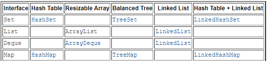
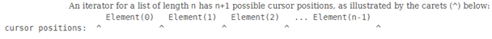
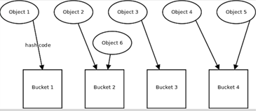
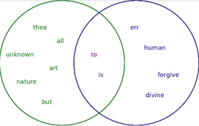

# 32-Collections
Collections Framework:   
List, ArrayList, LinkedList, Map, HashMap, Set, HashSet.Iterator, Comparable and Comparator. equals() and hashCode().   

This project contains 5 packages:  
-  1 simulate a mobile phone contacts list using ArrayLIst;  
-  2 create a music playlist using LinkedList;  
-  3 reserve seats in a theatre using lists, Comparable interface with compareTo() method.    
   Theatre class contains an inner Seat class that implement Comparable interface;    
-  4 create a map with location and direction for a game using Map interface and HashMap implementation;  
-  5 create a solar system representation using Set interface and HashSet implementation.   

[BACK TO START PAGE](https://github.com/FlorescuAndrei/Start.git)  

Collections Interface Implementation:  
   

| | | | |
|-------- |----------- |-------- |----------- |
| **Map** Interface key/value pairs(HashTable DataStructure for Java) Map<Key, Value> No duplicate keys | **HashMap** implementation  Map implementation No order | **LinkedHashMap** Order HashMap | **TreeMap** Sorted Map|  
| **Set** Interface Set<Value,>   **No duplicate** objects | **HashSet** Implementation **No order** Is backed up by an HashMap with key as the element and a dummy object as value | **LinkedHashSet** **Order** HashSet | **TreeSet**   **Sorted** Set  

   
**ArrayList**  
-	.add(), addAll(), .get(),  .set() – update, .remove()   
-	.contains() – search an item (boolean)  
-	.indexOf(serachItem) – return index  
-	.toArray() – transform ArrayList to a regular Array   

**Copy**  
-	Shallow copy – create a new list but refer to the same elements:   
ArrayList<String> newArray = new ArrayList<>(oldArray);  
-	Deep copy – copy the elements (more complex, use Collections.copy(), rarely use, not cover in here)  

**LinkedList**
-	.add(item), .add(position, item) = add(3, item)    
-	.remove()    
   
**ListIterator** – allows the programmer to traverse the list in either direction, modify the list, and obtain the current position.  
ListIterantor has no current position, its cursor position always lies between the element that would be returned by a call to previous() and the element that would be returned by a call to next().  
-	hasNext(), hasPrevious(), next(), previous(), nextIndex(), previousIndex()  
-	add(), remove(), set()    
When use .next()  return current position and move to the next one.    
ListIterator extends Iterator from java.util package.    
    

**Collections Methods:** 
-	Collections.sort(list)  
-	Collections.reverse(list)  
-	Collections.shuffle(list)  
-	Collections.min(list), .max(list)  
-	Collentions.swap(list, i, j)  
-	Collections.binarySearch(list, item, comparator).   
     The list must be sorted.  
     We need a comparator because the binary sort algorithm split in half the collection to be sorted and the items in the left half must be less than the items in the right half. If the item class implements Comparable, instead of comparator we pass null at comparator position.    
   
 
   
**Comparable interface vs Comparator**  
Needed to  sort the elements of a collection 
-	Comparable interface: the objects to be sorted must implement Comparable**<T,>**     
Override compareTo()method  
**Collections.sort(list)**  
   
-	Comparator
We can use Collectio.sort() method by passing a Comparator **Collections.sort(list, comparator)**.   
Comparator interface define a single method compare().   
The object to be sorted don’t have to implement Comparator, instead, an object of type Comparator can be created with the compare() method that can sort the objects.   
To create Comparator:    
    -	We can create a new class that implement Comparator. I do not refear to object class that we compare to implement Comparator. We will create a new class that implement Comparator   
    -	Create a comparator object using an anonymous inner class within an existing class  

   
**Map and HashMap**   

Key/Value pairs. HashTable DataStructure for Java.    
Key must be unique.  
Methods:  
-  .put(Key, value) 	- add a new element or replace an existing one  
-  .replace(key, oldValue,newValue)  
-  .containsKey() &emsp;   .keySet()  
Example of use: Vocabulary(letter, word). AdventureGame project - locations(direction, location)    

   
**Sets and HashSet**   
Set<Type,>  
Items from a set must be unique
Methods:  
-  add(), remove(), size() , isEmpty()... 
    
Set<type,> - Interface  &emsp;   	HashSet – Implementation of Set interface. No order.  No duplicates  
Map<keyType, valueType> Interface	&emsp;   HashMap – implementation of Map interface. No order.  No duplicates key.  
List is an order collection that can contain duplicates;   
   
HashSet   .add() do nothing if the object to add is equal to one that is allready in the list.    
HashMap  .put() replace the object if the keys are equal.    

Some sets have order: Treeset, LinkedHashSet.  
     
Set has no order and no duplicates. If we want a collection with no duplicates we go for sets;  
If we want to get all unique items from a collection, we can use a Set.  
If we want to perform operation like intersection, union, difference  we can use a sets.  
     
Everything that applies to Key in a Map applies to the Set.  We cannot have a duplicate key in Map and we cannot have duplicate elements in Set.  
HashSet implementation use a HashMap in java8– value as a key, and a dummy object as value;  
   
**.eauals(), .hashCode(), Immutable Classes**  
When we chose to use Set we want no duplicate elements. To achieve that we must create our objects as close as possible to be immutable and/or to have good equal() and hashCode() methods otherwise we will have duplicates because java will not see that the objects are equal.      

   
**Immutable Classes**     
Immutable classes once created  can not be changed.  
Key in Maps and Elements in Sets are good to be immutable but is not mandatory.  
For a class to be immutable:  
-  1 no setter method  
-  2 all fields final and private  
-  3 don t allow subclasses to override methods(one solution final class);  
-  4 if the instance fields include references to the mutable objects, don’t allow those objects to be changed:  
	    -  don’t provide methods that modify the mutable objects;  
	    -  don’t share references to the mutable objects. if necessary create copy and store references to the copies:   
  
   
If we cannot have a immutable clase java  recomands  to override the .hashCode() and .equal methods, and we mark them as final if we subclass the class for not to be overridden in subclass.    
The Java Object Class .equals() method compare equals if two references point to the same object. Same as ==.    == return true if it is the same object.  
     
**Hash code** is an integer value associated with an object.   
hashCode() method takes an object and return an int value.  
Every object have a hash code. The idea is to have a good hash function (hashCode() method), to generate different hash code for not equal objects, and same hash code for equal objects.   
   
In Java, Hash Collections like HashMap or HashSet, store objects in buckets. Hash code gives the bucket where the element will be stored. Equals elements should have the same hash code to be stored in thae sam bucket. If their hash code will not be equal, will be stored by the hash collection in different buckets.         
equals() is for verifying equality and hashCode() for place the object in the correct bucket. Equals object should be placed in the same bucket.   

LinkedList is a Collection  but not a Hash Collection, does not use hashcode() or buckets.    

If the elements to be compared are equals but have different hash codes they will not be compared as equals because will be placed in different buckets. The hash collection will look in the wrong buckets. Two objects to be compared equals must have the same hash Code to be in the same bucket. There is a strict relation sheep between equals() and hashCode().  
Different objects can have the same hashCode but that can be inefficient.   
Equals objects must have the same hashCode for HashMap key or HashSet to work properly.    
  
    
   
In Sets we have operations like  **intersection, union, and difference**  
A union of two or more sets is a set containing all the elements, no duplicates.  

**Symmetric and Asymmetric difference**  - type of the intersection  
Diagram with two Sets of Strings: Set nature(green), Set divine(blue), Intersection (red)  
 
 
Asymmetric difference:  a-b != b-a:  
-	nature – divine = all the green words  
- 	divine – nature = all blue words  

Symmetric difference = the elements that appear in one set and another but not both.      
Symmetric difference = union – intersection. Green and blue words.   
   
Bulk Operations  
-  .addAll()	- union get all elements, no duplicates  
-  .retainAll()	- intersection get all elements that are in both sets  
-  .removeAll	- difference: set1-set2  
-  .containsAll	- test if one set is a superset of another  - non distructive  
Bulk Operations  
The Collections framework has always provided a number of so-called "bulk operations" as part of its API. These include methods that operate on entire collections, such as containsAll, addAll, removeAll, etc. Do not confuse those methods with the aggregate operations that were introduced in JDK 8. The key difference between the new aggregate operations and the existing bulk operations (containsAll, addAll, etc.) is that the old versions are all mutative, meaning that they all modify the underlying collection. In contrast, the new aggregate operations do not modify the underlying collection. When using the new aggregate operations and lambda expressions, you must take care to avoid mutation so as not to introduce problems in the future, should your code be run later from a parallel stream. 
   
LinkedHashMap(have order)    
LinkedHashSet (order)    

Tree Map(Sorted Map)    
Tree Set(Sorted Set)    
   

[BACK TO START PAGE](https://github.com/FlorescuAndrei/Start.git)
